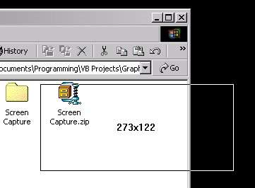



## Screen Capture

### Description

To capture the screen within a user defined selection, also captures a color from the screen in hex to be used in programming colors for html. No user form needed, just a small little exe that sits in the system tray, a right click will show it's functions. Copies to clipboard for quick use in another program. Source code uses bitblt for quick results instead of painting. This is all I wanted, works great, you may want to add an interface to allow you to save, edit, whatever the images you capture instead of just putting them in the clipboard. Also, shows the dimensions of what you are going to capture as you are dragging the mouse. If you click capture image the program will wait for you to click a start area, then drag the mouse (don't need to hold the mouse button down while dragging) and then click the left button when you are ready to capture, click the right mouse button if you want to start the capture over, click the esc key if you don't want to capture after all! Very fast on my machine, only tested with VB 6 SP4. Not tried on anything else.
 
### More Info
 
None I know of...

             |
---                |---
**Submitted On**   |2000-09-06 23:49:26
**By**             |[Shannon Harmon](https://github.com/Planet-Source-Code/PSCIndex/blob/master/ByAuthor/shannon-harmon.md)
**Level**          |Beginner
**User Rating**    |5.0 (50 globes from 10 users)
**Compatibility**  |VB 6\.0
**Category**       |[Graphics](https://github.com/Planet-Source-Code/PSCIndex/blob/master/ByCategory/graphics__1-46.md)
**World**          |[Visual Basic](https://github.com/Planet-Source-Code/PSCIndex/blob/master/ByWorld/visual-basic.md)
**Archive File**   |[CODE\_UPLOAD9707962000\.zip](https://github.com/Planet-Source-Code/shannon-harmon-screen-capture__1-11323/archive/master.zip)

